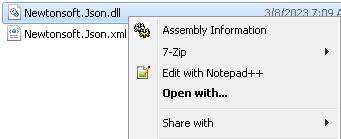
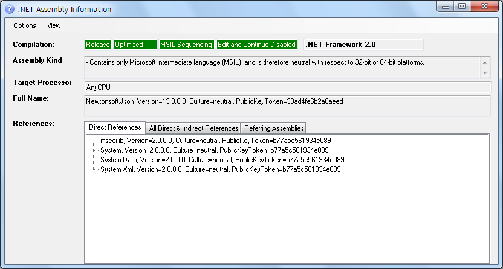

# Assembly Information

This is a fork and enhancement of the project originally hosted at [https://assemblyinformation.codeplex.com/](https://assemblyinformation.codeplex.com/) ([archive](https://web.archive.org/web/20171223025233/https://assemblyinformation.codeplex.com/) | [mirror](https://codeplexarchive.org/codeplex/project/AssemblyInformation)).

## Purpose
It adds a context menu option labeled "Assembly Information" that is dispalyed when right-clicking EXE and DLL files. Selecting it will display build information if the file is .NET. At a glance you can see things such as the .NET version used, whether it was built in release or debug, references, and more. See the screenshots below for a better idea of what is dispalyed.

## New Features in this Fork
1. Support for all versions of the .NET Framework (only 4.0 and below were supported before) and all versions of .NET Standard.
2. Clarification when only the CLR (Common Language Runtime) version is able to be detected.
3. Assembly Kind: Detection of the use of Preferred32Bit.
4. Target Processor: Detection of ARM.

## Screenshots

